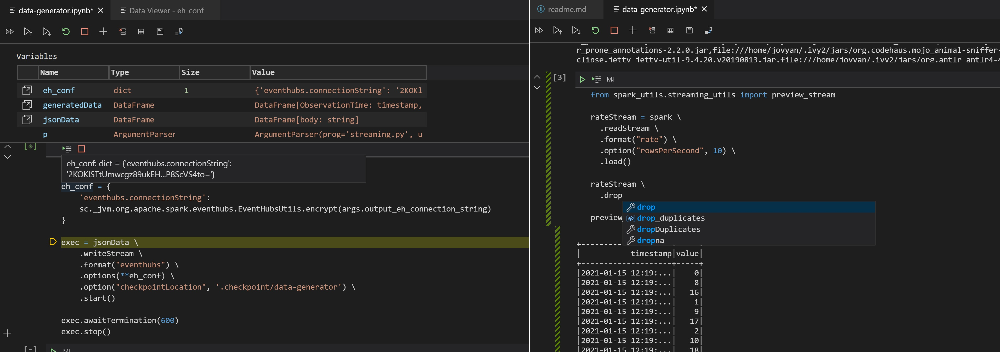

# Python Development Experience and Conventions

`streaming_job.py` corresponds to the streaming code to be deployed to the Spark cluster. In a nutshell, it reads data from Azure Event Hubs, parses it, flattens nested structures and writes results to Azure Storage. Compared to Jupyter or Databricks Notebooks plain python files utilize the full IDE support and functionality during development, interactive experimentation and tests.

This sample is optimized for a local spark deployment inside the configured DevContainer. Together with the local spark, Visual Studio Code python extension provides exceptional development experience for production python plain files development as well as data experimentation. Note that this setup is actually not recommended for any big data processing (use sampled data during development), performance tests or tuning. For more information check [DevContainer configuration](../../.devcontainer/).

## Streaming job code and spark_utils package

Main streaming job flow resides in [streaming_job.py](./streaming_job.py) file. If needed, other job files like batch processing can be also added to the same folder. As most of the actual spark code is extracted in [spark_utils](./spark_utils/) package, this design encourages modularization, reuse and unit testing. From local development perspective this package is perceived by tools as a normal module with refactoring and instant IntelliSense functionality provided out of the box. Simultaneously, the deployment process can build this code as a single unit, deploy it to the cluster and then reuse it for every job in the folder.

For both use cases as a local module or a package its functionality can be imported with a standard python `from spark_utils import *`. Make sure to configure `__all__` variable in the module's `__init__.py` [correctly](https://docs.python.org/3/tutorial/modules.html#packages).

`streaming_job.py` itself is a basic script file controlling the execution flow with a few aspects to notice:

* Configuration and secret management
* Spark context and configuration
* Execution loop

NOTE. To build the package during the CI/CD process execute:

```bash
    python setup.py sdist bdist_wheel
```

### Configuration and secret management

Python has an extensive configuration functionality that can be overwritten during Spark Submit. This sample utilized [configargparse](https://pypi.org/project/ConfigArgParse/) package as it allows to associate environment variables to parameters as well as pass configuration in files. Command line arguments and environment variables (mainly for secrets) proved to be an approach to configure the job during the deployment with `spark-submit` overrides. At the same time, file configurations are handy for local development, interactive experimentation and debugging. Below is the sample's `configargparse` definition. Mind `default_config_files` constructor parameter and environment variable name override for the storage account key.

```python
    p = configargparse.ArgParser(prog='streaming.py',
                                description='Streaming Job Sample',
                                default_config_files=['configuration/run_args_streaming.conf'],
                                formatter_class=configargparse.ArgumentDefaultsHelpFormatter)
    p.add('--storage-account-name', type=str, required=True,
        help='Azure Storage account name (used for data output and checkpointing)')
    p.add('--storage-account-key', type=str, required=True,
        help='Azure Storage key', env_var='STREAMING_STORAGE_KEY')
    p.add('--storage-container-name', type=str, required=False, default='data',
        help='Azure Storage container name')
```

During the local development and experimentation, the corresponding configuration file content can be used to avoid the need to pass arguments manually on every run:

```conf
    storage-account-name=mystorageacoount
    storage-account-key=<account-key>
    storage-container-name=data
```

### Spark context and configuration

Compared to Databricks jobs, SparkSession and the corresponding `spark` variable should be created manually before the first use. The code below shows how to do that. Note, that this code doesn't break Databricks run pattern and can be safely used there without any changes.

```python
   spark_conf = SparkConf(loadDefaults=True) \
        .set('fs.azure.account.key.{0}.dfs.core.windows.net'.format(args.storage_account_name),
            args.storage_account_key)

    spark = SparkSession\
        .builder\
        .config(conf=spark_conf)\
        .getOrCreate()

    sc = spark.sparkContext 
```

SessionConf is another critical part to consider. Spark has a myriad of different configurations affecting every bit of behavior from performance to security. The full list can be found [here](http://spark.apache.org/docs/latest/configuration.html). In this solution two different approaches are utilized to provide an optimal experience. [spark-defaults.conf](../../.devcontainer/spark-defaults.conf) is used and recommended to set default spark configuration to simulate DataBricks environment, manage maven packages and define common job configuration. On the top of it, `SparkSession` provides a way to specify job-specific overrides and pass secrets (see Azure Storage Account key above). For more information on `spark-defaults.conf` check the corresponding section of the [DevContainer README](../../../.devcontainer/README.md#spark-configuration).

What makes Databricks a perfect technology for production is its high optimization and fine-tuning of Spark configuration parameters. Sometimes it proves useful to replicate some of that parameters to the local dev environment. Execute the code below on the Databricks cluster to print all set configuration values and then replicate a few of them in `spark-defaults.conf` locally:

```python
    sc = spark.sparkContext
    print("Spark Configuration:")
    _ = [print(k + '=' + v) for k, v in sc.getConf().getAll()]
```

### Execution loop

Another difference between Databricks Notebooks and python file jobs lies in the execution loop handling in streaming jobs. For Databricks, `start()` call at the end of the loop is usually enough to request a streaming job to run until the completion or a failure. Python script on the other hand will exit immediately as the `start` call returns without blocking the thread. A special Spark function `awaitTermination` can be used to replicate the behavior:

```python
    execution = out_stream.start()
    execution.awaitTermination()
```

## Development Experience

Besides a more convenient development approach with python scripts, modules and tests, the local Spark environment together with an IDE like Visual Studio Code's [Python Extension](https://marketplace.visualstudio.com/items?itemName=ms-python.python) allows convenient and familiar development experiences.

### IntelliSense, Refactoring and other development tools

First and foremost, full featured IntelliSense support is desirable as it significantly simplifies Spark API discovery. The same applies for other convenient development tools like refactoring and "go to definition". They are available out of the box for every `.py` and `.ipynb` file in the folder.


### Debugging and local job execution

This sample uses [VSCode Remote - Containers](https://marketplace.visualstudio.com/items?itemName=ms-vscode-remote.remote-containers) to simplify the development environment set up. In the most of the cases it is as simple as clicking "Reopen in Container" in VSCode UI to get Spark and the corresponding development tools up and running. Check the corresponding [README](../../../.devcontainer/README.md) in the `.devcontainer` folder for more information.

Once it's ready, the normal VSCode python debugging experience is available: open the job file to run or debug, set breakpoints, and run debug session in debug menu. All the familiar features like variable hovering, step in/over as well as external library debugging are available immediately.


As the Spark engine is installed and configured in the container, debug session actually instantiates a worker process to run and debug the code allowing developers to access to the actual execution behavior. So that, make sure that the corresponding configuration with real values has been provided as well as all required maven packages have been listed in the `spark-defaults.conf` file.

If the whole debugging experience is not required, then the code can be run directly with `python streaming_job.py`.

### Experimentation and interactive development

Data development is usually more convenient when there is a way to get immediate feedback on your assumptions about data structure, check filters and intermediate outputs. That's why Python/DataBricks Notebooks are so popular especially at the early stages of development. Thankfully, VSCode python extension provides a way to get the same level of Jupyter interactivity inside the IDE while still keeping IntelliSense and debugging support.



To start, open the [data-generator.ipynb](./data-generator.ipynb) file in the extension. It contains a data generation code for the sample, but in the convenient notebook format. Internally it runs the same IKernel python kernel that is normally used with jupyter, but renders it inside the VSCode. This view provides a way to rerun the cells, make experiments and explore the data. Simultaneously, it supports some of the features of the plain text files, guaranteeing IntelliSense support, hovering as well as debugging: just click "run line by line" at the top of the cell to automatically attach to the corresponding IKernel process and initiate debugging.

The only consideration is that Databricks has a convenient `display` function that is not available locally. To simulate its behavior, use dataframe's `.show()` action to display the preview or utilize console output (check `preview_stream` function in [streaming_preview.py](./spark_utils/streaming_utils/streaming_preview.py)) to output stream.

### Plain code experiments

While notebooks format is convenient for experimentation, notebooks cannot be executed in the production environment. For that purpose VSCode Python extensions provides a special magic comment format (`# %%`) that splits plain code into cells, allowing to achieve the similar level of experimentation while writing production ready code. Check `streaming_job.py` file for "Run cell" and "Debug cell" commands above the `# %%` comments. The only difference with the notebooks from above is that cell output is displayed to the right in a dedicated preview window and is not retained between sessions.


As this format doesn't allow to pass run arguments (compared to debugging), `spark_defaults.conf` and `run_args` usage were purposefully designed to support the scenario of just-in-time check of the production-ready code during development.

### Spark UI

During development or experimentation, sometimes it is handy to get access to the Spark UI to check logs, job expecution plans and time graphs. DevContainer is configured to track openned port, so that it notifies about every new opened port whether it's an ordinary development, Jupyter notebooks or in-code cell execution. So, just accept the invitation to open the browser on a port like 4040, 4041 etc to get directly into the Spark UI.


### Tests

DevContainer configuration and Dockerfile comes with support for pytest. Check the corresponding README inside the tests folder for more details on design and execution.

VSCode python extension allows to debug and run tests individually providing the experience similar to one of the experimentation sections above. It might prove handy to run and fix code behavior in the edge situations that are hard to replicate with the ordinary experimentation. To try it, navigate to one of the test files in tests folder, set a breakpoint and run "Debug Test" above.
